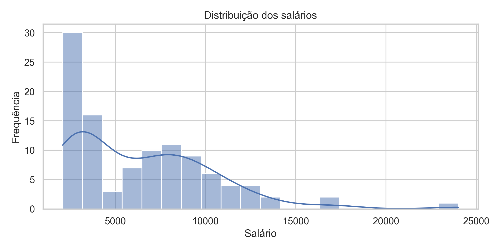
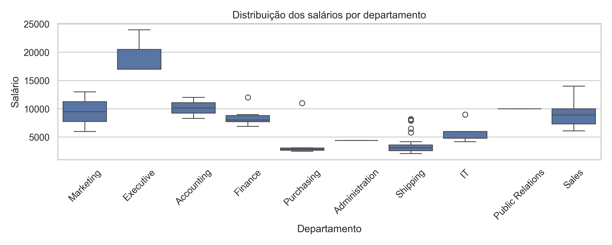
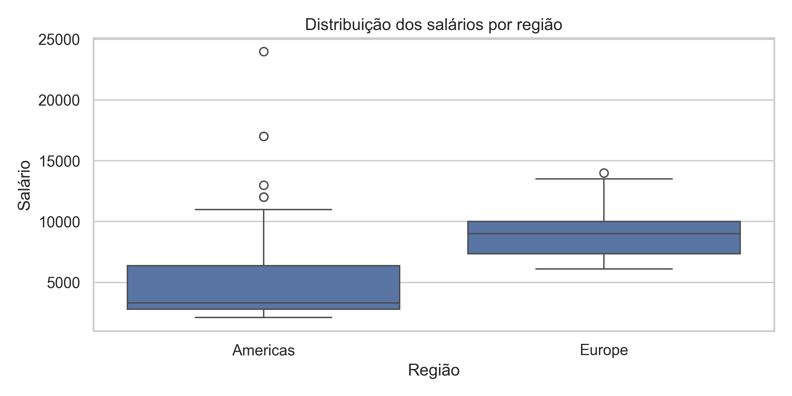
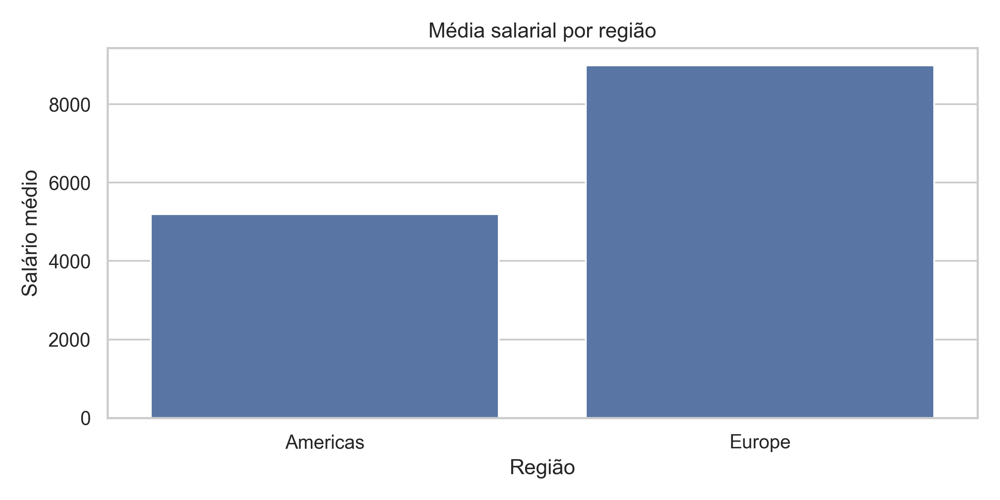

# Análise Exploratória de Salários em Recursos Humanos

## Identificação

- **Aluna: Andressa Alves de Souza**
- **Turma: Visualização de Dados e BI (T2)**

## Descrição do projeto

Este projeto apresenta uma análise exploratória de dados de Recursos
Humanos, com foco na estrutura salarial dos funcionários. A solução foi
desenvolvida a partir de consultas SQL para extração dos dados e de uma
etapa posterior de tratamento, análise e visualização em Python.

A proposta do trabalho é compreender como os salários se distribuem
entre diferentes cargos, departamentos e regiões, identificando padrões
de remuneração, dispersões salariais e possíveis valores atípicos na
base analisada.

## Objetivo do trabalho

O objetivo deste trabalho é analisar os dados salariais de uma base de
Recursos Humanos, utilizando SQL e Python, com a finalidade de:

- observar a distribuição dos salários;
- comparar salários entre cargos;
- comparar salários entre departamentos;
- comparar salários entre regiões;
- identificar outliers salariais;
- gerar insights que contribuam para a compreensão da política de
  remuneração da organização.

## Ferramentas utilizadas

Para o desenvolvimento deste projeto, foram utilizadas as seguintes
ferramentas e tecnologias:

- **SQL**: utilizado para consultar e extrair os dados da base de
  Recursos Humanos;
- **Python**: linguagem principal empregada na etapa de tratamento e
  análise dos dados;
- **Pandas**: biblioteca usada para manipulação, limpeza e análise dos
  dados tabulares;
- **Matplotlib**: biblioteca utilizada para geração de gráficos;
- **Seaborn**: biblioteca utilizada para criação de visualizações
  estatísticas com melhor apresentação visual;
- **Jupyter Notebook**: ambiente utilizado para desenvolvimento da
  análise exploratória comentada;
- **Git**: ferramenta de versionamento do projeto;
- **GitHub**: plataforma utilizada para armazenar, organizar e
  documentar o repositório;
- **Markdown**: linguagem utilizada na escrita da documentação do
  projeto no arquivo `README.md`.

## Explicação simples das tabelas utilizadas

Para o desenvolvimento do projeto, foram utilizadas tabelas
relacionadas ao contexto de Recursos Humanos, contendo informações
sobre funcionários, cargos, departamentos e localização.

De forma simplificada, as tabelas utilizadas representam:

- **Funcionários:** dados dos empregados, como identificação, nome e
  salário;
- **Cargos:** informações sobre a função exercida e a faixa salarial
  do cargo;
- **Departamentos:** identificação e nome dos setores da empresa;
- **Localizações:** dados relacionados ao local onde o departamento
  está inserido;
- **Países e regiões:** informações geográficas que permitem comparar
  salários entre diferentes localidades.

Essas tabelas foram combinadas por meio de consultas SQL para montar as
bases finais utilizadas na análise.

## Como os dados foram buscados

Os dados foram obtidos a partir de consultas SQL realizadas sobre uma
base de Recursos Humanos. O processo consistiu em selecionar e combinar
informações relevantes de diferentes tabelas, utilizando relacionamentos
entre funcionários, cargos, departamentos e localização.

Após a execução das consultas, os resultados foram exportados em
arquivos CSV e utilizados na etapa de análise em Python.

## Resumo das duas consultas SQL

### Query 1

A primeira consulta SQL foi desenvolvida para reunir informações
essenciais sobre os funcionários, seus respectivos cargos,
departamentos e salários. Essa query permite analisar como a
remuneração varia conforme a função exercida e a área em que o
funcionário está alocado.

Em resumo, a Query 1 foi utilizada para responder perguntas como:

- quais cargos possuem maiores médias salariais;
- como os salários se distribuem entre diferentes funções;
- quais departamentos concentram determinados cargos.

### Query 2

A segunda consulta SQL complementa a primeira ao incorporar a dimensão
geográfica da análise. Nela, além dos dados de funcionários,
departamentos e salários, foram incluídas informações de localização,
país e região.

Essa query permitiu ampliar a investigação para comparar salários entre
regiões e analisar a influência do contexto geográfico na estrutura de
remuneração.

## Estrutura do projeto

```bash
analise-salarios-rh-freesql/
├── dados/
│   ├── query_01.csv
│   └── query_02.csv
├── imagens/
│   ├── histograma_salarios_q2.png
│   ├── boxplot_salarios_departamento_q2.png
│   ├── boxplot_salarios_regiao_q2.png
│   └── barplot_media_regiao_q2.png
├── notebooks/
│   └── analise_rh.ipynb
├── sql/
│   └── consultas.sql
├── src/
│   └── analise_rh.py
└── README.md
```

### Descrição das pastas

- `dados/`: contém os arquivos CSV gerados a partir das consultas SQL;
- `imagens/`: armazena os gráficos gerados na análise;
- `notebooks/`: contém o notebook com a análise exploratória comentada;
- `sql/`: reúne as consultas SQL utilizadas;
- `src/`: contém o script Python de execução da análise;
- `README.md`: documentação principal do projeto.

## Explicação da análise feita em Python

Após a extração dos dados em SQL, a análise foi realizada em Python com
o apoio das bibliotecas `pandas`, `matplotlib` e `seaborn`.

O processo analítico foi dividido nas seguintes etapas:

1. leitura dos arquivos CSV;
2. criação de cópias dos dados originais;
3. renomeação das colunas para português;
4. limpeza e tratamento dos dados;
5. cálculo de estatísticas descritivas;
6. análise de frequência das categorias;
7. comparação salarial por cargo, departamento e região;
8. identificação de outliers;
9. geração de gráficos para interpretação dos resultados.

## Como a base foi tratada

Antes da análise exploratória, a base passou por um processo de
tratamento para garantir maior consistência dos resultados.

As principais etapas de tratamento foram:

- criação de cópias dos dataframes originais para preservar a base bruta;
- renomeação das colunas para facilitar a leitura e padronização;
- remoção de linhas com valores nulos;
- remoção de registros duplicados;
- conferência das colunas e tipos de dados antes da análise.

Esse tratamento foi importante para evitar distorções e assegurar maior
confiabilidade nas análises realizadas.

## Pré-requisitos

Para executar o projeto, é necessário ter instalado:

- Python 3.x;
- pip;
- Jupyter Notebook (opcional, para abrir o notebook);
- bibliotecas Python:
  - pandas
  - matplotlib
  - seaborn

## Como executar o projeto

### 1. Clonar o repositório

```bash
git clone https://github.com/andressasouza98/analise-salarios-rh-freesql
```

### 2. Acessar a pasta do projeto

```bash
cd analise-salarios-rh-freesql
```

### 3. Instalar as dependências

```bash
pip install pandas matplotlib seaborn jupyter
```

### 4. Executar o script Python

```bash
python src/analise_rh.py
```

### 5. Abrir o notebook (opcional)

```bash
jupyter notebook notebooks/analise_rh.ipynb
```

## O que foi observado na análise

A análise exploratória permitiu observar que os salários não estão
distribuídos de maneira uniforme entre os funcionários. Foram
identificadas diferenças importantes entre cargos, setores e regiões,
além da presença de dispersões salariais distintas conforme o grupo
analisado.

Também foi possível perceber que determinadas categorias concentram
maiores faixas salariais, enquanto outras apresentam remuneração mais
homogênea e próxima ao padrão predominante da base.

## Principais resultados encontrados

Os principais resultados obtidos no projeto foram:

- identificação da distribuição salarial dos funcionários;
- cálculo de estatísticas descritivas, como média, mediana, mínimo e
  máximo;
- comparação de salários entre cargos;
- comparação de salários entre departamentos;
- comparação de salários entre regiões;
- identificação de valores atípicos (outliers) na base salarial;
- geração de gráficos para apoiar a interpretação dos dados.

## Principais insights

A análise gerou alguns insights importantes:

- a distribuição salarial apresenta assimetria, com influência de
  salários mais elevados sobre a média;
- cargos de liderança e gestão concentram as maiores médias salariais;
- cargos operacionais e administrativos tendem a apresentar salários
  menores e menor dispersão;
- alguns departamentos apresentam maior variabilidade salarial,
  indicando diversidade de cargos e níveis hierárquicos;
- a média salarial varia entre regiões, sugerindo influência de fatores
  geográficos e organizacionais;
- existem outliers salariais que merecem atenção em análises futuras de
  política de remuneração.

## Resultados visuais

A seguir, estão alguns dos gráficos gerados durante a análise:

### Histograma da distribuição dos salários



### Boxplot de salários por departamento



### Boxplot de salários por região



### Média salarial por região



## Conclusão

A análise exploratória de dados permitiu compreender de forma mais
aprofundada a estrutura salarial da base de Recursos Humanos estudada.
Os resultados mostraram que a remuneração varia significativamente entre
cargos, departamentos e regiões, além de apresentar valores atípicos
que merecem atenção.

De modo geral, o projeto evidencia a importância da análise de dados no
apoio à gestão de pessoas, especialmente em discussões sobre equidade
salarial, estrutura remuneratória e planejamento estratégico de RH.

## Sugestões de melhoria para futuras versões

Como possibilidades de evolução do projeto, destacam-se:

- inclusão de novas variáveis, como tempo de empresa e histórico de
  promoções;
- comparação entre salário atual e faixa salarial do cargo;
- criação de dashboards interativos;
- ampliação da análise para outros indicadores de RH;
- aplicação de análises estatísticas complementares;
- automatização mais completa da geração de relatórios e gráficos.

## Autor

Projeto desenvolvido por Andressa Alves de Souza como atividade prática de
análise de dados com SQL e Python.